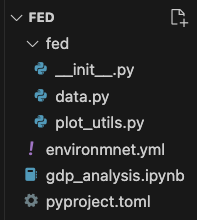

# PS1_ex_2_build_a_repo

This is the solution to PS1 ex 2: build a repo structure.

## Setup

Install the virtual environment and install your repo from source:

```bash
conda env create -f environment.yml
conda activate gdp
pip install --no-build-isolation -e .
```

## Objective

Build a repository taking into account the principals of modularity to load, clean, and visualise
GDP data for the UK, Japan, China, Germany, and Switzerland from 2000 to 2022.

Your repository should look something like this at the end:



### Tasks

- Find monthly or yearly GDP data for UK, USA, Brasil, Japan, China, Germany, and Switzerland from
  2000 to 2022.
- Write code to:
  - load the data
  - clean the data
  - plot the data
- Write your code as functions.
- Create an analysis Notebook that imports your own functions and executes them to showcase the
  results.
- Briefly describe the GDP development of these different countries over the years

## Guidelines

- Use Git and GitHub for version control and collaboration.
- Allocate specific tasks to each team member and complete these tasks using Pull Requests.
- Implement modular code structure for improved maintainability. Create functions in modules and
  import those functions in your analysis notebook to showcase your results abstracting away the
  implementation details.

## Reflection Question

**Question**: When you made a pull request adding the Jupyter Notebook, what did you realise?
